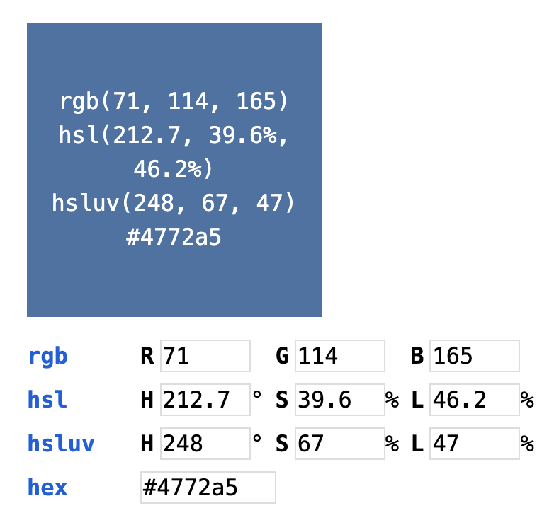

# Chromamatic

This is a color chooser tool
that not only supports converting colors between RGB, HSL, and hex,
but also the [HSLuv][hsluv] color space.
HSLuv acts like HSL,
except its lightness component is more true to how we perceive light.

At the moment, it looks like this:

[hsluv]: https://www.hsluv.org/

## Development

To run this locally, first run:

    yarn install

Then you can say:

    yarn start

After this, visit:

    http://localhost:1234/

## Author/License

© 2020 Elliot Winkler (<elliot.winkler@gmail.com>).
Released under the [un-license](LICENSE).
