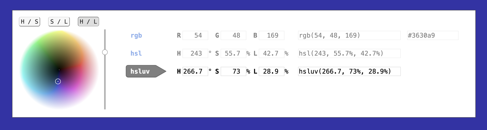

# Chromamatic

This is a color chooser tool
that not only supports manipulating colors in RGB, HSL, and hex,
but also [HSLuv][hsluv].
HSLuv is a color space that acts like HSL,
except its lightness component is more true to how we see light,
so it is more useful than HSL for spacing out colors with different hues
at the same perceived lightness.

[hsluv]: https://www.hsluv.org/

**[Try it out →](https://chromamatic.now.sh/)**

## Development

To run this locally, first run:

    yarn install

Then you can say:

    yarn start

After this, visit:

    http://localhost:1234/

## Author/License

© 2020 Elliot Winkler (<elliot.winkler@gmail.com>).
Released under the [un-license](LICENSE).
